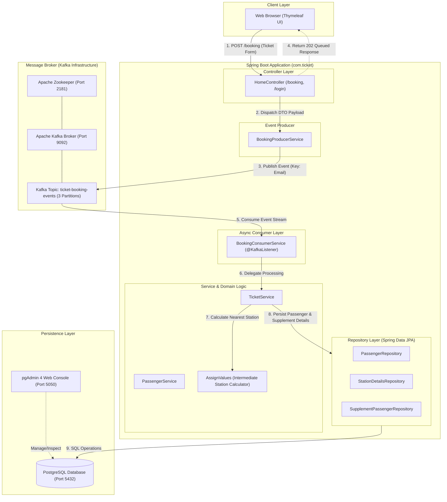

# Railway Ticket Booking System

A Spring Boot application for managing railway ticket bookings with station management and passenger tracking.

## Architecture Diagram



## Features

- User Authentication (Signup/Login)
- Station Management
- Ticket Booking System
- Intermediate Station Assignment
- PostgreSQL Database Integration

## Tech Stack

- Java 17
- Spring Boot
- PostgreSQL
- Thymeleaf (Templates)
- Maven

## Prerequisites

- Java 17 or higher
- Maven
- PostgreSQL
- Git

## Local Development Setup

1. Clone the repository:
```bash
git clone https://github.com/Harish-2004/TicketSpringBoot-Updated.git
cd demoWeb-SpringBoot
```

2. Configure PostgreSQL:
   - Create a database named `ticketsystem`
   - Update `src/main/resources/application.properties` with your database credentials:
     ```properties
     spring.datasource.url=jdbc:postgresql://localhost:5432/ticketsystem
     spring.datasource.username=your_username
     spring.datasource.password=your_password
     ```

3. Build the application:
```bash
./mvnw clean install
```

4. Run the application:
```bash
./mvnw spring-boot:run
```

The application will be available at `http://localhost:8080`

## Docker & pgAdmin Setup (One-Command Run)

Run the full stack (PostgreSQL + pgAdmin + Spring Boot App) with a single command:

```bash
docker compose up --build
```

### Services & Endpoints:

| Service | Access URL | Credentials / Details |
| :--- | :--- | :--- |
| **Spring Boot App** | `http://localhost:8080` | Web application UI |
| **pgAdmin 4** | `http://localhost:5050` | **Email**: `admin@admin.com`<br>**Password**: `admin` |
| **PostgreSQL DB** | `localhost:5432` | **Database**: `ticketsystem2`<br>**User**: `postgres` \| **Pass**: `admin` |

#### Connecting pgAdmin to PostgreSQL Database:
1. Open `http://localhost:5050` and log in.
2. Click **Add New Server**.
3. **General** tab: Name = `TicketDB`
4. **Connection** tab:
   * **Host name / address**: `db`
   * **Port**: `5432`
   * **Maintenance database**: `ticketsystem2`
   * **Username**: `postgres`
   * **Password**: `admin`


## Database Schema

The application uses the following tables:

1. `login` - User authentication
   - emailid (Primary Key)
   - name
   - password

2. `train` - Station information
   - stations (Primary Key)
   - value

3. `passengerbooking` - Ticket bookings
   - email (Primary Key)
   - name
   - starting
   - destination

4. `supplementpassengers` - Intermediate stations
   - email (Primary Key)
   - intermediate_station

## Deployment to Railway

### Option 1: Deploy from GitHub

1. Push your code to GitHub
2. Go to [Railway Dashboard](https://railway.app/dashboard)
3. Create a new project
4. Select "Deploy from GitHub repo"
5. Choose your repository
6. Add a PostgreSQL database from Railway dashboard

### Option 2: Deploy using Railway CLI

1. Install Railway CLI:
```bash
npm i -g @railway/cli
```

2. Login to Railway:
```bash
railway login
```

3. Initialize and deploy:
```bash
railway init
railway up
```

## Environment Variables

The following environment variables are used in production:

- `DATABASE_URL`: PostgreSQL connection URL
- `DATABASE_USERNAME`: Database username
- `DATABASE_PASSWORD`: Database password
- `PORT`: Application port (default: 8080)

## Project Structure

```
src/
├── main/
│   ├── java/
│   │   └── com/
│   │       └── ticket/
│   │           ├── controller/
│   │           ├── service/
│   │           ├── repository/
│   │           └── model/
│   └── resources/
│       ├── templates/
│       ├── application.properties
│       └── application-cloud.properties
```

## Contributing

1. Fork the repository
2. Create your feature branch (`git checkout -b feature/AmazingFeature`)
3. Commit your changes (`git commit -m 'Add some AmazingFeature'`)
4. Push to the branch (`git push origin feature/AmazingFeature`)
5. Open a Pull Request


## Support

For support, please open an issue in the GitHub repository.
